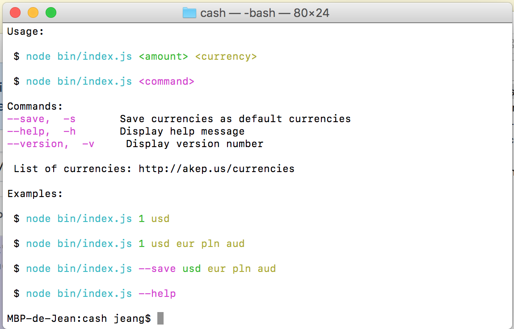

# Cash application 


Cash is a tool to using Nodejs to easily convert currencies.

You can add currencies as default currencies.

<p align="center">
  
</p>


## How It Works

Cash use an api named fixer.io and load every currencies you need (on this list http://akep.us/currencies)
Everything happens in the shell.


## Usage

First, install `cash` (all dependencies):

```sh
$ cd cash
$ npm install 
```

Run the index.js

```sh
$ node bin/index.js
```

Everything it's explained :

* For convert an amount in the same shell type 
```sh
$ node bin/index.js <amount> <currency> 
```
* For use a command
```sh
$ node bin/index.js <command>
```
List of commands : 
--save,  -s       Save currencies as default currencies
--help,  -h       Display help message
--version,  -v     Display version number


Exemples 
```sh
 $ node bin/index.js 1 usd

 $ node bin/index.js 1 usd eur pln aud

 $ node bin/index.js --save usd eur pln aud

 $ node bin/index.js --help

```

## Applications

easy 

```diff
$ node bin/index.js 22 eur

✔ 27.04 (USD) US Dollar
✔ 19.56 (GBP) Pound Sterling

 Conversion of EUR 22

```


## JavaScript API

```js
const got = require('got');
const money = require('money');
const chalk = require('chalk');
const ora = require('ora');
const currencies = require('../lib/currencies.json');

const API = 'https://api.fixer.io/latest';

const convert = configuration => {
  const {amount, to, from, response, loading} = configuration;

```
